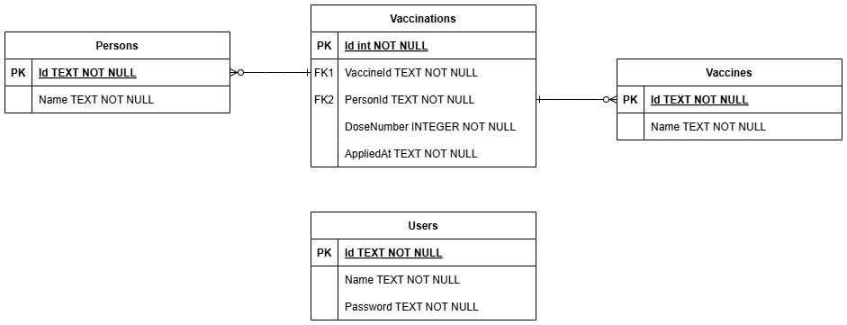

# VaccinationSystem
Sistema de gerenciamento de vacinas

Para a implementação e fácil entrega do projeto, optou-se por manter tanto o frontend quanto o backend no mesmo repositório. Em um projeto real, eles estariam implementados em repositórios diferentes para organização do versionamento.

O documento a seguir descreve como executar o projeto e o que foi implementado.

# Índice
- [Executar o projeto](#executar-o-projeto)
	- [Executar via Docker](#executar-via-docker)
	- [Executar manualmente](#executar-manualmente)
- [Conceitos de negócios](#conceitos-de-negócios)
- [Requisitos funcionais](#requisitos-funcionais)
- [Decisões arquiteturais e técnicas](#decisões-arquiteturais-e-técnicas)
- [Projetos implementados](#projetos-implementados)
  - [Backend/VaccinationSystem](#backendvaccinationsystem)
    - [Organização do projeto](#organização-do-projeto)
    - [Endpoints desenvolvidos](#endpoints-desenvolvidos)
    - [Modelagem de dados](#modelagem-de-dados)
  - [Frontend/vaccination-system-frontend](#frontendvaccination-system-frontend)
    - [Organização do projeto](#organização-do-projeto-1)
- [Commits](#commits)

## Executar o projeto

Existem dois jeitos de executar o projeto após cloná-lo, através do `docker compose` ou manualmente. Todos os comandos devem ser executados a partir da raíz do projeto, onde este documento se encontra.

Para os dois métodos, a aplicação terá dados de exemplo.

O usuário disponível para login possui as seguintes credenciais:

- Nome: user
- Senha: user

### Executar via Docker

Para executar o projeto via docker, basta executar o comando a seguir:
```
docker compose up --build
```

A API estará disponível em http://localhost:8080

O frontend estará disponível em http://localhost:4200

### Executar manualmente

Para executar manualmente, é necessário executar tanto o módulo do backend, quanto do frontend. 

- Executar o frontend: 
```
cd Frontend/vaccination-system-frontend
npm install
ng serve
```
- Executar o backend: 
```
cd Backend/VaccinationSystem/src/VaccinationSystem.Api
dotnet restore
dotnet run
```

A API estará disponível em http://localhost:8080

O frontend estará disponível em http://localhost:4200

## Conceitos de negócios
- Usuário (user): pessoa (cadastrada com nome de usuário e senha, ou não) que utiliza a plataforma.

- Paciente/pessoa (person): pessoa registrada como paciente na plataforma, com um nome. Pode receber doses de vacinas. Os conceitos de usuário e paciente são independentes (um usuário pode cadastrar/alterar quaisquer pacientes).

- Vacina (vaccine): item capaz de ser associado a qualquer paciente. Quando um paciente recebe uma vacina, um novo registro de vacinação é criado, contendo a dose e a data da aplicação.

- Registro de vacinação (vaccination): registro gerado que associa uma vacina a um paciente, contendo a dose aplicada e a data de aplicação.

- Dose (dose): Valor numérico que indica quantas vezes uma vacina já foi aplicada a um usuário.

## Requisitos funcionais
Os seguintes requisitos funcionais, descritos no enunciado, foram implementados:

- "Cadastrar uma vacina: Uma vacina consiste em um nome e um identificador único."

- "Cadastrar uma pessoa: Uma pessoa consiste em um nome e um número de identificação único."

- "Remover uma pessoa: Uma pessoa pode ser removida do sistema, o que também implica na exclusão de seu cartão de vacinação e todos os registros associados."

- "Cadastrar uma vacinação: Para uma pessoa cadastrada, é possível registrar uma vacinação, fornecendo informações como o identificador da vacina e a dose aplicada (A dose deve ser validada pelo sistema).": O enunciado não descreve como a validação deve ser feita. Assim, considerou-se que o usuário apenas pode cadastrar uma dose uma unidade maior que a última dose tomada (se o paciente A tomou a dose 3 da vacina B, a próxima necessariamente deve ser a dose 4). Doses não podem ser aplicadas retroativamente (caso existam as doses 1 e 2, e a dose 1 seja excluída, ela não poderá, seguindo esse modelo, ser cadastrada novamente). Essa interpretação foi tomada para simplificar possíveis edge-cases.

- "Consultar o cartão de vacinação de uma pessoa: Permite visualizar todas as vacinas registradas no cartão de vacinação de uma pessoa, incluindo detalhes como o nome da vacina, data de aplicação e doses recebidas."

- "Excluir registro de vacinação: Permite excluir um registro de vacinação específico do cartão de vacinação de uma pessoa.": Como o requisito funcional não especifica que validações sejam realizadas para a exclusão de registro de vacinação, e de modo a simplificar interações com novos registro de vacinação, nenhuma validação é aplicada neste caso, e o usuário pode excluir qualquer registro.

- Além disso, também foi implementada a exclusão de vacinas, apesar de não estar descrita como requisito funcional.

- A atualização da data de um registro de vacinação, do nome uma pessoa ou do nome de uma vacina não foram implementadas, uma vez que não estão inclusas como requisito funcionais na lista de funcionalidades.

- Registro de usuário e login: Foi implementado mecanismo de autenticação e autorização via JWTs. Assim, o usuário da plataforma pode se cadastrar, com um nome e senha, e realizar o login, utilizando as credenciais criadas. Todas as demais funcionalidades do sistema requerem que o usuário esteja logado.

## Decisões arquiteturais e técnicas

- Utilizar princípios de Clean Architecture:

	Criar projetos separados para responsabilidades separadas diminui o acoplamento entre diferentes partes do sistema, estabelece limites concretos de ação entre um subsistema e outro, simplifica mudanças futuras e localiza possíveis erros. 

	Além disso, pensar nos contratos e dependências que os subsistemas devem possuir entre si ajuda a entender o sistema como um todo e a localizar possíveis pontos de redundância ou melhoria.

	Assim, o projeto de backend foi dividido em 5 camadas: 
	- API (ou apresentação)
	- Aplicação
	- Domínio
	- Infraestrutura
	- Testes 

	O objetivo é que as dependências fiquem voltadas para o domínio, e o domínio seja independente, uma vez que as regras de negócio não devem depender de decisões técnicas.

- Utilizar Domain-Driven Design

	Domain-Driven Design (DDD) fornece uma approach robusta e sistêmica no que tange às regras de negócio. Ao identificar aggregates, aggregate roots e child entities, é possível localizar dependências de dados, centralizar e simplificar implementações de regras de negócios, garantir a manutenção de invariantes e se proteger contra a futura complexidade do sistema, que, caso contrário, pode levar a duplicação de código, edge-cases escondidos e overhead de manutenção elevado.

- Utilizar GUID (UUID) em vez de inteiros para identificadores:

	A utilização de GUIDs dificulta ataques externos ao sistema, através do mascaramento da relação entre recursos diferentes, uma vez que não é possível prever a identificação de recursos desconhecidos ou comparar a identificação de recursos diferentes.

	Além disso, reduz a possibilidade de que o identificador de um recurso seja incorretamente reconhecido como o identificador de outro, já que a probabilidade de colisões é reduzida.

- Centralizar handling de exceções em um middleware:

	Ao utilizar um middleware para centralizar o handling de exceções, é possível padronizar os erros e as respostas que cada caso deve gerar, além de separar o handling de erros da lógica da aplicação, o que torna o código mais modularizado e fácil de entender.


## Projetos implementados

### Backend/VaccinationSystem: 
- API e banco de dados, acessível em http://localhost:8080
- Swagger UI configurado e acessível em http://localhost:8080/swagger/index.html
- Documentação de endpoints disponível em http://localhost:8080/swagger/v1/swagger.json
- ASP.NET Core / .NET 10
- Entity Framework Core 10.0.8
- MediatR 14.1.0
- Swashbuckle.AspNetCore 10.2.1
- FluentValidation 12.1.1
- SQLite
- Moq 4.20.72
- xUnit 2.9.3

A API utiliza o Swagger UI para testes durante o desenvolvimento e gera automaticamente a documentação OpenApi para os endpoints. Além disso, implementa testes unitários referentes a cada use-case desenvolvido, os quais serão descritos adiante.

#### Organização do projeto:
Para o desenvolvimento da API foi utilizado o conceito de Domain-Driven Design (DDD) e Clean Architecture. Assim, para garantir a separação de responsabilidades, a solução foi dividida em 5 projetos:

- src/VaccinationSystem.Api: 

	Camada de apresentação, controllers, handling HTTP, injeção de dependências e middleware. Componentes principais:

	- Controllers: Controladores responsáveis por implementar as ações e endpoints da API.

	- Middlewares/ExceptionHandlingMiddleware.cs: Middleware para centralizar o handling de exceções.

	- Properties: Contém configurações de inicialização para a API. A API está configurada para HTTP apenas. Em um projeto real, o ambiente de produção deveria utilizar HTTPS para maior segurança.

	- Swagger/DependencyInjectionSwaggerGen.cs: Classe para encapsulamento da injeção de dependências e configurações necessárias para o Swagger UI.

	- vaccination.db: Base de dados SQLite utilizada para persistência.

- src/VaccinationSystem.Application: 

	Camada de aplicação, orquestração de serviços, exceções a nível de aplicação, handlers para cada use-case, commands, queries e DTOs necessários. 

	A camada foi modelada em torno de use-cases, que definem a lógica de cada endpoint, e optou-se por manter DTOs e validators juntos ao seu handler, de modo a encapsular totalmente a modelagem de dados internamente a cada use-case. 

	Caso a aplicação crescesse e use-cases necessitassem compartilhar de modelagens de dados, para evitar duplicação, poderia optar-se por separar os DTOs necessários em uma pasta compartilhada.

	- Auth:
		- Auth/LogIn: Ação de login do usuário. Contém o comando, o handler, o DTO de resposta e o validator para o comando.

		- Auth/RegisterUser: Ação de cadastramento de um usuário novo. Contém o comando e o handler (validator desnecessário pois o comando não contém parâmetros de entrada).

	- Persons:
		- Persons/CreatePerson: Ação de criação de um novo paciente. Contém o comando, o handler e o validator utilizado para o comando.

		- Persons/DeletePerson: Ação de deleção de um paciente. Contém o comando, o handler e o validator utilizado para o comando.

		- Persons/GetPerson: Ação de listagem de um paciente específico. Traz as informações de registros de vacinações associados. Contém a query, o handler, o validator e os DTOs utilizados no retorno.

		- Persons/GetPersons: Ação de listagem de todos os pacientes. Contém a query, o handler e o DTO utilizado para retorno (validator desnecessário pois a query não recebe parâmetros).

	- Vaccinations:
		- Vaccinations/CreateVaccination: Ação de criação de um registro de vacinação. Contém o comando, o handler, o validator do comando e o DTO de retorno.

		- Vaccinations/DeleteVaccination: Ação de deleção de um registro de vacinação. Contém o comando, o handler e o validator do comando.

	- Vaccines:
		- Vaccines/CreateVaccine: Ação de criação de uma vacina. Contém o comando, o handler e o validator para o comando.

		- Vaccines/DeleteVaccine: Ação de deleção de uma vacina. Contém o comando, o handler e o validator para o comando.

		- Vaccines/GetVaccines: Ação de listagem de todas as vacinas. Contém a query, o handler e o DTO de retorno (validator desnecessário pois a query não recebe parâmetros).

	- Common/Behaviors/ValidationBehavior.cs: Configuração de pipeline de validação para o MediatR. Utiliza os validators desenvolvidos com o FluentValidation.

	- Common/Exceptions: Conjunto de exceções a nível de aplicação. Utilizada para abstrair possíveis erros de aplicação sem depender de códigos HTTP (responsabilidade da camada de apresentação/API).

	- Common/Interfaces: Conjunto de interfaces que definem os contratos estabelecidos entre a camada de aplicação e a camada de infraestrutura.

	- DependencyInjection.cs: Arquivo que encapsula a injeção de dependências a nível da aplicação. Inclui a injeção dos validators, dos handlers e dos pipeline behaviors.

- src/VaccinationSystem.Domain:

	Camada de domínio da aplicação, responsável por modelar os dados seguindo lógica de domínio, e abstrair detalhes de implementação da base de dados. Possui aggregate roots, entidades filhas e exceções a nível de domínio.

	- Aggregates: Conjunto de modelos de dados que representam aggregate roots do projeto. Os aggregate roots definidos foram Person e Vaccine.

	- Auth: Modelagem de dados específica de autenticação/autorização. Contém a definição de User.

	- Common/Exceptions: Contém exceções a nível de domínio, isto é, erros causados a partir de violações de regras de negócio e invariantes.

	- Common/Entities: Entidades filhas, dependentes dos aggregates. Vaccination, neste caso, foi considerada como inseparável de Person, uma vez que não existe registro de vacinação sem um paciente associado. 

- src/VaccinationSystem.Infrastructure:

	Camada de infraestrutura, responsável por abstrair a comunicação com a base de dados e o mapeamento dos conceitos de negócio para as tabelas utilizadas.

	- Auth: Serviços de auth a nível de infraestrutura, como configuração e geração de JWTs e injeção de dependência de serviços específicos de autenticação/autorização.

	- Migrations: Contém o histórico de migrações realizadas na base de dados.

	- Persistence/Configurations: Contém as configurações das entidades declaradas para o Entity Framework Core e o mapeamento de cada uma para os objetos da base de dados.

	- Persistence/Repositories: Contém as implementações dos repositórios responsáveis por se comunicar diretamente com o contexto da base de dados.

	- Persistence/AppDbContext.cs e Persistence/UnitOfWork.cs: Implementação do contexto da base de dados e do conceito de "unit of work".

	- DependencyInjection.cs: Classe responsável por encapsular as injeções de dependência de serviços de infraestrutura (exceto auth), como repositórios e o AppDbContext.

- tests/VaccinationSystem.Tests>

	Contém os testes unitários desenvolvidos para os projetos. Os testes devem ser divididos de acordo com o nível dos componentes testados. Apenas testes referentes à camada de aplicação (handlers e validators) foram implementados, sendo que testes referentes à camada de infraestrutura (repositories e serviços de auth) também poderiam ser criados.

	- Application: 

	Contém os testes unitários da camada de aplicação. Toda a estrutura de arquivos é um espelho da estrutura criada para os use-cases de VaccinationSystem.Application e a nomenclatura segue o padrão `{classe testada}Tests.cs`. 

	As funções que definem os testes seguem o padrão de nomenclatura `{método da classe a ser testado}_{condições propostas para o teste}_{resultado esperado}`.

	Ao total, foram implementados 49 testes, cobrindo as validações esperadas para respostas de erro dos endpoints.

#### Endpoints desenvolvidos:
Para manter este arquivo sucinto, os endpoints são formalmente descritos no arquivo `endpoints.md`

#### Modelagem de dados:
O diagrama representando a modelagem realizada via configuração do Entity Framework Core para a base de dados é exibida a seguir:



### Frontend/vaccination-system-frontend: 
- Frontend da aplicação / camada de UI
- Acessível em http://localhost:4200
- Angular 22
- Node.js 24.16.0

#### Organização do projeto
O projeto do frontend é dividido em quatro diretórios principais:

- api: Mantém serviços e modelos relevantes para a integração com a API. É subdividida em:
	- auth: Serviços e modelos de autenticação/autorização
	- person: Serviços e modelos relacionados ao paciente
	- vaccination: Serviços e modelos relacionados a registros de vacinação
	- vaccine: Serviços e modelos relacionados ao gerenciamento de vacinas

- core: Mantém serviços centrais que são compartilhados pelo programa. Aqui é implementado uma guard (guards/auth.guard.ts), utilizada para proteger páginas contra acesso sem que o usuário esteja logado, e um interceptor (interceptors/auth-interceptor.ts), utilizado para adicionar o header "Authorization" às chamadas, uma vez que o usuário esteja logado.

- pages: Contém as páginas (componentes) desenvolvidas para a aplicação:
	
	- pages/home: Página home, contendo gerenciamento de pacientes e registros de vacinação. 
		- Essa página possui como subcomponente "vaccination-card", que é o componente responsável por exibir informações do paciente e permitir o gerenciamento de sua carteira de vacinação.
	
	- pages/login: Página de login, utilizada para obter o JWT.

	- pages/register: Página de registro de um novo usuário.

	- pages/vaccines: Página de gerenciamento de vacinas.

- shared/components: Contém componentes reaproveitáveis por outros componentes da aplicação:

	- shared/components/confirm-modal: Modal de confirmação.
	- shared/components/dose-management-modal: Modal de gerenciamento de uma dose de vacinação.
	- shared/components/modal: Modal base, utilizado pelos outros modais.
	- shared/components/person-modal: Modal para deleção de um paciente.
	- shared/components/spinner: Componente utilizado para exibir uma ação em carregamento.
	- shared/components/vaccination-register-modal: Modal para adição de registro de vacinação.
	- shared/components/vaccine-management-modal: Modal para gerenciamento de uma vacina.
	- shared/components/vaccine-register-modal: Modal para o registro de uma nova vacina.

Devido ao tamanho pequeno do projeto, optou-se por criar modelos de dados diretamente dentro dos componentes, conforme necessário. Em projetos maiores, com maior reutilização de modelos, é apropriado guardá-los em um diretório centralizado, conforme necessário.


### Commits
As commits foram padronizadas da seguinte forma:

- feat: Commit de feature, em que uma funcionalidade esperada do sistema é implementada;
- fix: Commit de correção de bugs, em que um bug ou falha localizados são corrigidos;
- chore: Commit de configuração, em que uma funcionalidade nova não é implementada, mas configurações necessárias são criadas ou implementadas;
- refactor: Commit de refatoração, em que código e arquivos são modificados em prol de melhor organização e legibilidade;
- docs: Commits específicas para criação e atualização de documentação do projeto.